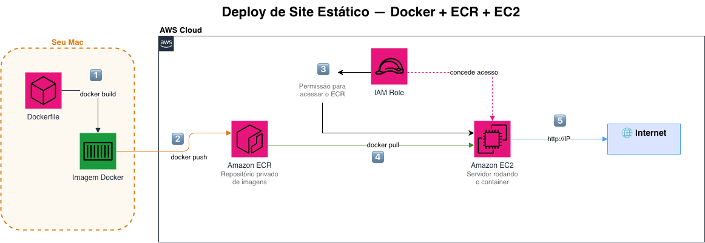

# 🐳 Deploy de Site Estático com Docker + AWS

Projeto prático de DevOps: containerização de um site estático com Docker e deploy manual na AWS usando ECR e EC2.

---

## 🎯 Objetivo

Simular o dia a dia de um DevOps Engineer resolvendo um problema real: fazer o deploy de uma aplicação de forma isolada, portátil e reproduzível, eliminando o famoso problema de "funciona na minha máquina".

---

## 🏗️ Arquitetura



---

## 🚀 Tecnologias Utilizadas

- **Docker** — containerização da aplicação
- **Amazon ECR** — repositório privado de imagens Docker
- **Amazon EC2** — servidor na nuvem para rodar o container
- **AWS IAM** — controle de permissões (princípio do privilégio mínimo)
- **Nginx** — servidor web dentro do container
- **AWS CLI** — gerenciamento da AWS pelo terminal

---

## 📋 Pré-requisitos

- Conta AWS (Free Tier)
- Docker Desktop instalado
- AWS CLI instalado e configurado
- Git instalado

---

## ⚙️ Como Reproduzir

### 1. Clone o repositório
```bash
git clone https://github.com/Rafaelmcf/devops-lab-docker-ec2.git
cd devops-lab-docker-ec2
```

### 2. Build da imagem Docker
```bash
# Mac Apple Silicon (M1/M2/M3/M4)
docker buildx build --platform linux/amd64 -t meu-website:v1.0 .

# Mac Intel / Linux
docker build -t meu-website:v1.0 .
```

### 3. Teste local
```bash
docker run -d -p 8080:80 --name meu-website-container meu-website:v1.0
# Acesse http://localhost:8080
```

### 4. Push para o ECR
```bash
# Login no ECR
aws ecr get-login-password --region us-east-1 | docker login --username AWS --password-stdin [SEU_ACCOUNT_ID].dkr.ecr.us-east-1.amazonaws.com

# Push da imagem
docker buildx build --platform linux/amd64 \
  -t [SEU_ACCOUNT_ID].dkr.ecr.us-east-1.amazonaws.com/meu-website:v1.0 \
  --push .
```

### 5. Deploy na EC2
```bash
# Conectar via SSH
ssh -i meu-website-key.pem ec2-user@[IP_DA_EC2]

# Instalar Docker na EC2
sudo yum update -y
sudo yum install docker -y
sudo systemctl start docker
sudo systemctl enable docker
sudo usermod -a -G docker ec2-user

# Login no ECR e pull da imagem
aws ecr get-login-password --region us-east-1 | docker login --username AWS --password-stdin [SEU_ACCOUNT_ID].dkr.ecr.us-east-1.amazonaws.com
docker pull [SEU_ACCOUNT_ID].dkr.ecr.us-east-1.amazonaws.com/meu-website:v1.0

# Rodar o container
docker run -d -p 80:80 --name meu-website-prod --restart always \
  [SEU_ACCOUNT_ID].dkr.ecr.us-east-1.amazonaws.com/meu-website:v1.0
```

---

## 📸 Screenshots

### Site no ar na AWS


### Container rodando na EC2


### Imagem no Amazon ECR


### Instância EC2 Running


---

## 💡 O que aprendi

- Como containerizar uma aplicação com Docker
- Como funciona um repositório privado de imagens (ECR)
- Como provisionar e configurar um servidor na AWS (EC2)
- Conexão remota em servidor via SSH
- Permissões IAM aplicando o princípio do privilégio mínimo
- Diferença entre arquiteturas AMD64 e ARM64 em containers

---

## 🔗 Referências

- [Laboratório DevOps — Maria Lázara](https://github.com/marialazara/laboratorio-devops)
- [Documentação Docker](https://docs.docker.com/)
- [AWS ECR Documentation](https://docs.aws.amazon.com/ecr/)
- [AWS EC2 User Guide](https://docs.aws.amazon.com/ec2/)
