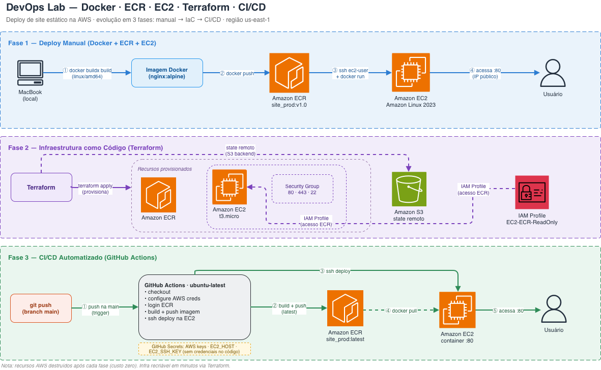
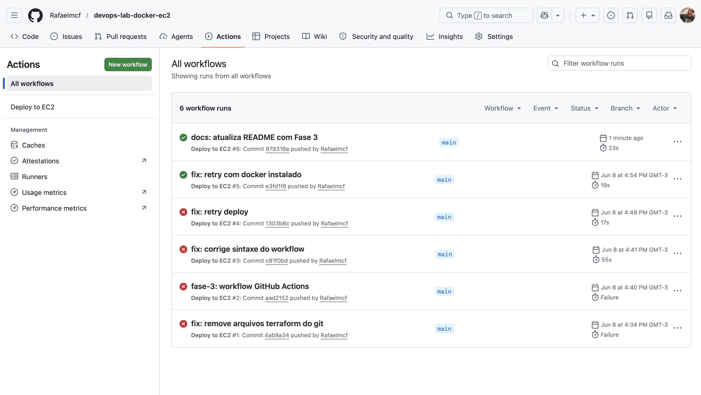
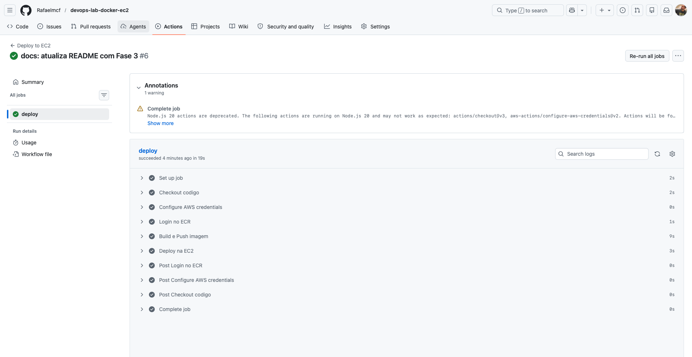
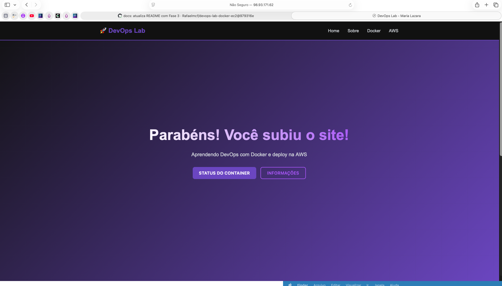

# 🐳 DevOps Lab: Docker + EC2 + Terraform + CI/CD

Laboratório DevOps prático baseado no conteúdo da [Maria Lazara](https://www.youtube.com/@marialazaradev), construído em fases progressivas para simular a evolução real de um ambiente de deploy — do manual ao totalmente automatizado com infraestrutura como código e pipeline CI/CD.

> **Nota:** Os recursos AWS foram destruídos após cada fase para evitar custos. Este repositório documenta a arquitetura, os comandos e o processo completo para fins de portfólio.

## 🎯 Sobre o Projeto

Um site estático containerizado com Docker e deployado na AWS. O foco não é o site em si — é o **processo DevOps ao redor dele**: como empacotar, versionar, provisionar infraestrutura e automatizar deploys de forma progressiva.

---

## 🏗️ Arquitetura



---

## 🗂️ Estrutura do Repositório

```
devops-lab-docker-ec2/
├── website/                        # HTML, CSS, JS do site
├── Dockerfile                      # Imagem baseada em nginx:alpine
├── .github/
│   └── workflows/
│       └── deploy.yml              # Pipeline CI/CD GitHub Actions
├── fase-2-terraform/               # Infraestrutura como Código
│   ├── provider.tf                 # Configuração do provider AWS
│   ├── ec2.tf                      # Instância EC2 + Security Groups
│   ├── ecr.tf                      # Repositório ECR
│   └── backend.tf                  # Estado remoto no S3
└── Screenshots/
    ├── ec2-running.png
    ├── ecr-imagem-v1.png
    ├── site_aws_ec2.png
    ├── docker-ps-ec2.png
    ├── terraform-apply.png
    ├── ec2-tags-terraform.png
    ├── ecr-terraform.png
    ├── site_aws_terraform.png
    ├── docker_ps_terraform.png
    ├── github-actions-success.png
    ├── github-actions-steps.png
    └── site-fase-3.png
```

---


## 🚀 Fase 1 — Containerização com Docker e Deploy Manual

### O problema resolvido

Deploy manual direto no servidor causa erros de dependências: "funciona na minha máquina, mas não no servidor". Docker empacota o site com tudo que precisa rodar, garantindo consistência em qualquer ambiente.

### Ferramentas utilizadas

| Ferramenta | Função |
|---|---|
| **Docker** | Containerizar o site estático |
| **Amazon ECR** | Registry privado para armazenar a imagem |
| **Amazon EC2** | Servidor para rodar o container |
| **AWS CLI** | Autenticação e operações na AWS |
| **SSH** | Acesso remoto à instância |

### Passo a passo do deploy

**1. Autenticar no ECR e fazer build da imagem**

```bash
aws ecr get-login-password --region us-east-1 | \
  docker login --username AWS --password-stdin \
  905663669292.dkr.ecr.us-east-1.amazonaws.com

docker buildx build --platform linux/amd64 \
  -t 905663669292.dkr.ecr.us-east-1.amazonaws.com/site_prod:v1.0 \
  --push \
  ~/projetos/laboratorio-devops/projeto-devops-fase-1/.
```

> O flag `--platform linux/amd64` é necessário no MacBook M4 (ARM) para gerar uma imagem compatível com EC2 (x86).

**2. Conectar na EC2 via SSH**

```bash
ssh -i ~/projetos/laboratorio-devops/projeto-devops-fase-2/chave-site-prod.pem \
  ec2-user@<IP_EC2>
```

**3. Autenticar no ECR dentro da EC2 e rodar o container**

```bash
aws ecr get-login-password --region us-east-1 | \
  docker login --username AWS --password-stdin \
  905663669292.dkr.ecr.us-east-1.amazonaws.com

docker run -d -p 80:80 \
  --name meu-website-prod \
  --restart always \
  905663669292.dkr.ecr.us-east-1.amazonaws.com/site_prod:v1.0
```

### Screenshots

| ECR com imagem v1.0 | Site no ar via EC2 |
|---|---|
|  |  |

| Container rodando (docker ps) | EC2 Running |
|---|---|
|  |  |

---

## 🏗️ Fase 2 — Infraestrutura como Código com Terraform

### O problema resolvido

Na Fase 1 toda a infraestrutura foi criada manualmente clicando no console AWS — demorado e sujeito a erros. Na Fase 2 a mesma infraestrutura é criada automaticamente via código com Terraform em segundos.

### Ferramentas utilizadas

| Ferramenta | Função |
|---|---|
| **Terraform** | Provisionar EC2, ECR e Security Groups via código |
| **S3 (backend)** | Armazenar o state file remotamente |
| **IAM Instance Profile** | Permitir que a EC2 acesse o ECR sem credenciais hardcoded |

### Arquivos Terraform

**`provider.tf`** — configura o provider AWS e a região

**`ecr.tf`** — cria o repositório ECR

```hcl
resource "aws_ecr_repository" "ecr_site" {
  name = "site_prod"
}
```

**`ec2.tf`** — cria a instância EC2 com tags e IAM Profile

```hcl
resource "aws_instance" "website_server" {
  ami                  = "ami-08e6829e013be2292"
  instance_type        = "t3.micro"
  key_name             = "chave-site-prod"
  iam_instance_profile = "EC2-ECR-ReadOnly"

  tags = {
    Name        = "website-server"
    Provisioned = "Terraform"
  }
}
```

**`backend.tf`** — estado remoto no S3 para trabalho em equipe

### Comandos utilizados

```bash
cd fase-2-terraform

terraform init      # baixa providers e configura backend
terraform plan      # mostra o que será criado
terraform apply     # provisiona a infraestrutura
terraform destroy   # destrói tudo (evitar custos)
```

### Recursos provisionados via Terraform

- `aws_ecr_repository` — repositório ECR `site_prod`
- `aws_instance` — EC2 `t3.micro` com Amazon Linux 2023
- `aws_security_group` — regras de acesso HTTP (80), HTTPS (443) e SSH (22)
- `aws_vpc_security_group_ingress_rule` — 3 regras de entrada
- `aws_vpc_security_group_egress_rule` — saída liberada

### Screenshots

| Terraform apply | EC2 com tag "Provisioned: Terraform" |
|---|---|
|  |  |

| ECR criado pelo Terraform | Site no ar via infraestrutura automatizada |
|---|---|
|  |  |

---

## ⚙️ Fase 3 — CI/CD com GitHub Actions

### O problema resolvido

Nas fases anteriores o deploy era feito manualmente: build local, push para o ECR e SSH na EC2. Na Fase 3 todo esse processo é automatizado — basta um `git push` para o site ser atualizado na AWS sem nenhuma intervenção manual.

### Ferramentas utilizadas

| Ferramenta | Função |
|---|---|
| **GitHub Actions** | Orquestrar o pipeline CI/CD |
| **GitHub Secrets** | Armazenar credenciais com segurança |
| **appleboy/ssh-action** | Executar comandos remotos na EC2 via SSH |
| **aws-actions/amazon-ecr-login** | Autenticar no ECR dentro do pipeline |

### Passo a passo do pipeline

A cada `git push` na branch `main`, o GitHub Actions executa automaticamente:

**1. Checkout** — baixa o código do repositório

**2. Configure AWS credentials** — autentica na AWS usando Secrets

**3. Login no ECR** — faz login no registry privado da AWS

**4. Build e Push** — constrói a imagem Docker e envia para o ECR

**5. Deploy na EC2** — acessa via SSH, faz pull da nova imagem e reinicia o container

### Workflow (`.github/workflows/deploy.yml`)

```yaml
name: Deploy to EC2

on:
  push:
    branches:
      - main

jobs:
  deploy:
    runs-on: ubuntu-latest

    steps:
      - name: Checkout codigo
        uses: actions/checkout@v3

      - name: Configure AWS credentials
        uses: aws-actions/configure-aws-credentials@v2
        with:
          aws-access-key-id: ${{ secrets.AWS_ACCESS_KEY_ID }}
          aws-secret-access-key: ${{ secrets.AWS_SECRET_ACCESS_KEY }}
          aws-region: us-east-1

      - name: Login no ECR
        uses: aws-actions/amazon-ecr-login@v2

      - name: Build e Push imagem
        run: |
          docker build -t 905663669292.dkr.ecr.us-east-1.amazonaws.com/site_prod:latest .
          docker push 905663669292.dkr.ecr.us-east-1.amazonaws.com/site_prod:latest

      - name: Deploy na EC2
        uses: appleboy/ssh-action@v1
        with:
          host: ${{ secrets.EC2_HOST }}
          username: ec2-user
          key: ${{ secrets.EC2_SSH_KEY }}
          script: |
            aws ecr get-login-password --region us-east-1 | docker login --username AWS --password-stdin 905663669292.dkr.ecr.us-east-1.amazonaws.com
            docker pull 905663669292.dkr.ecr.us-east-1.amazonaws.com/site_prod:latest
            docker stop website || true
            docker rm website || true
            docker run -d --name website -p 80:80 905663669292.dkr.ecr.us-east-1.amazonaws.com/site_prod:latest
```

### Secrets configurados no GitHub

| Secret | Descrição |
|---|---|
| `AWS_ACCESS_KEY_ID` | Credencial de acesso AWS |
| `AWS_SECRET_ACCESS_KEY` | Credencial secreta AWS |
| `EC2_HOST` | IP público da instância EC2 |
| `EC2_SSH_KEY` | Chave privada SSH para acesso à EC2 |

### Screenshots

| Pipeline verde no GitHub Actions | Steps do workflow |
|---|---|
|  |  |

| Site no ar após deploy automatizado |
|---|
|  |

---

## 💡 Decisões Técnicas

**Por que `--platform linux/amd64` no build?**
O MacBook M4 usa arquitetura ARM. Sem esse flag, a imagem gerada é ARM e não roda em instâncias EC2 convencionais (x86). O `buildx` com `--platform linux/amd64` força a compilação cruzada.

**Por que ECR e não Docker Hub?**
O ECR é o registry nativo da AWS, integrado ao IAM. A EC2 com Instance Profile acessa o ECR sem precisar de credenciais hardcoded — mais seguro e a abordagem usada em produção.

**Por que `--restart always` no docker run?**
Garante que o container suba automaticamente caso a EC2 seja reiniciada, sem intervenção manual.

**Por que GitHub Secrets e não variáveis no código?**
Credenciais nunca devem ficar expostas no código. Os Secrets ficam criptografados no GitHub e são injetados no pipeline em tempo de execução, sem aparecer nos logs.

**Por que destruir os recursos após o projeto?**
Boa prática em Cloud: recursos ociosos geram custo. O Terraform permite recriar tudo em minutos com `terraform apply`, então não há necessidade de manter a infraestrutura ativa.

**Por que Terraform e não criar pelo console?**
Infraestrutura como código é versionável, reproduzível e auditável. Com Terraform, o mesmo ambiente pode ser recriado em qualquer conta AWS ou região sem risco de erros manuais.

---

## 📚 Conceitos Praticados

- Containerização com Docker (build, push, run)
- Build multiplataforma com `docker buildx`
- Registry privado com Amazon ECR
- Deploy em EC2 com Amazon Linux 2023
- Acesso remoto via SSH com key pair
- IAM Instance Profile para permissões sem credenciais hardcoded
- Infraestrutura como Código com Terraform
- State file remoto com S3 backend
- Security Groups (HTTP, HTTPS, SSH)
- Ciclo completo: `terraform init → plan → apply → destroy`
- Pipeline CI/CD com GitHub Actions
- GitHub Secrets para gestão segura de credenciais
- Deploy automatizado via SSH

---

## 👨‍💻 Autor

**Rafael Figueiredo**
Transição de carreira para Cloud Computing | AWS | Docker | Terraform | DevOps

[](https://linkedin.com/in/rafaelmcfigueiredo)
[](https://github.com/Rafaelmcf)

---

*Laboratório baseado no conteúdo de [Maria Lazara](https://www.youtube.com/@marialazaradev)*
